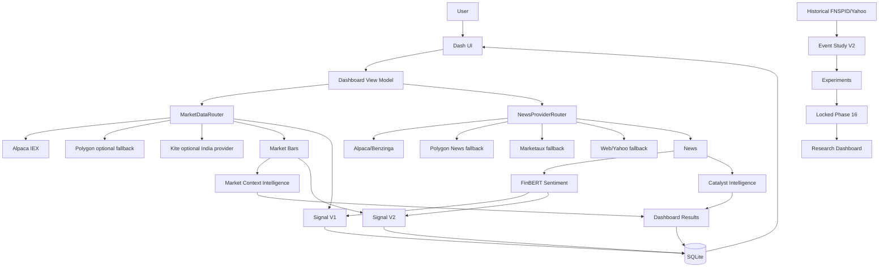

# FinSent

Financial News Sentiment & Short-Term Market Intelligence Platform

FinSent is a local Dash application for financial news sentiment, catalyst explanation, live/latest market context, and short-term signal research. It is designed for academic demonstration and research reproducibility, not for automated trading or investment advice.

## What FinSent Does

Live application path:

```text
ticker
  -> live/latest market data
  -> live/current news
  -> FinBERT sentiment
  -> Catalyst Intelligence
  -> Market Context Intelligence
  -> Signal V1 and Signal V2
  -> SQLite persistence
  -> Dash dashboard
```

Historical research path:

```text
bounded FNSPID/Yahoo research data
  -> no-lookahead article cohorts
  -> Event Study V2 outcomes
  -> Signal V1/V2 experiments
  -> locked Phase 16 final evaluation
  -> read-only Research dashboard
```

The two paths are intentionally separate. The live app explains current market/news conditions. The research path preserves a locked historical evaluation and should not be rerun or tuned against the final holdout.

## Current Capabilities

- Live Alpaca IEX US quotes, snapshots, intraday bars, and current Alpaca/Benzinga news when Alpaca credentials are configured.
- Optional Polygon, Kite, and Marketaux provider fallbacks where credentials exist.
- FinBERT live news sentiment through the optional research dependency set.
- Deterministic Catalyst Intelligence: catalyst type, direction, impact, horizon, novelty, recency, event grouping, and priority.
- Signal V1 live scoring and Signal V2 live component scoring.
- Market Context Intelligence for US demo symbols: SPY/QQQ context, sector ETF comparison, market-relative and sector-relative returns, volatility, correlation, beta, and market regime.
- Compare view for multi-symbol relative sentiment, price movement, catalysts, and market context.
- Research dashboard for locked Phase 16 evaluation artifacts.
- Runtime diagnostics for provider health, cache state, DB health, FinBERT state, refresh timing, and build commit.
- Offline/local research mode using the local SQLite DB and bundled research artifacts when live credentials or internet are unavailable.

## Important Limitations

- Alpaca Basic uses IEX coverage by default. It is not a consolidated SIP market feed.
- US live market context is the main supported live demo path; NSE/BSE support is provider-dependent and not benchmark-complete.
- FinBERT's first unseen inference can be synchronous unless the optional warm-up command is used.
- SQLite, provider caches, and diagnostics are local process resources, not a production distributed architecture.
- The Dash server is a local demo/development server.
- The supported symbol universe is curated in code, not a full-market screener.
- Signal confidence is an engineering reliability score, not a probability of price movement.
- The locked Phase 16 final cohort showed V2.0 underperformed V1 on strict and balanced accuracy. Do not present V2 as proven better.
- Application signals are explanatory research outputs and are not investment advice.

## Architecture



## Provider Matrix

| Area | Provider | Market | Role | Credential |
|---|---|---|---|---|
| Market data | Alpaca | US | Primary live demo quotes/bars | `ALPACA_API_KEY`, `ALPACA_API_SECRET` |
| Market data | Polygon | US | Optional fallback | `POLYGON_API_KEY` |
| Market data | Kite | NSE/BSE | Optional India provider | `KITE_API_KEY`, `KITE_ACCESS_TOKEN` |
| News | Alpaca/Benzinga | US | Primary current news | `ALPACA_API_KEY`, `ALPACA_API_SECRET` |
| News | Polygon | US | Optional fallback | `POLYGON_API_KEY` |
| News | Marketaux | US/NSE/BSE | Optional fallback | `MARKETAUX_API_TOKEN` |
| News | Web/Yahoo | US/NSE/BSE | Last fallback/local web path | Optional Gemini/Yahoo/yfinance path |

## Setup

- Windows: [docs/SETUP_WINDOWS.md](docs/SETUP_WINDOWS.md)
- macOS: [docs/SETUP_MACOS.md](docs/SETUP_MACOS.md)
- Alpaca credentials: [docs/ALPACA_SETUP.md](docs/ALPACA_SETUP.md)
- Configuration variables: [docs/CONFIGURATION.md](docs/CONFIGURATION.md)
- Data bundle: [docs/DATA_BUNDLE.md](docs/DATA_BUNDLE.md)

Minimum live demo requirements:

1. Python environment with `requirements.txt`.
2. `requirements-research.txt` for FinBERT.
3. Root `.env` with Alpaca key pair.
4. Writable local SQLite path, normally `data/finsent.db`.
5. Internet access for live Alpaca calls.

Minimum research demo requirements:

1. Python environment.
2. Tracked Phase 16 artifacts under `output/research/phase16`.
3. Optional data bundle for the fuller local DB/research-source state.

Full demo requirements:

1. Code checkout.
2. Python dependencies.
3. Alpaca `.env`.
4. Data bundle extracted directly into the repository root.

## Commands

Run demo preflight:

```bash
python -m finsent.scripts.demo_preflight
```

Optionally warm FinBERT and the demo workspace:

```bash
python -m finsent.scripts.demo_preflight --warm
```

Start dashboard:

```bash
python -m finsent.scripts.run_dashboard
```

Open:

```text
http://127.0.0.1:8050/
```

Run pipeline smoke:

```bash
python -m finsent.scripts.run_pipeline --ticker AAPL --limit 15
```

Run tests:

```bash
pytest -q
```

Compile check:

```bash
python -m compileall -q finsent
```

## Dashboard Routes

| Route | Page |
|---|---|
| `/` | Overview, same functional page as `/summary` |
| `/summary` | Overview |
| `/stock-detail` | Stock Research |
| `/news-impact` | News Intelligence |
| `/compare` | Compare |
| `/research` | Locked Research Dashboard |
| `/alerts` | Operational Watchlist |

Alerts are contextual dashboard signals derived from the current workspace. FinSent does not implement email alerts, push notifications, or persistent alert subscriptions.

## Research Results

The locked Phase 16 1D final cohort has `N=111` technical-eligible observations from AMZN, NVDA, and TSLA using bounded FNSPID/Yahoo research data.

| Metric | Signal V1 | Signal V2.0 |
|---|---:|---:|
| Strict accuracy | 32.4% | 22.5% |
| Balanced accuracy | 51.9% | 39.2% |
| Directional accuracy | 50.0% | 54.3% |

Baselines:

| Baseline | Strict accuracy |
|---|---:|
| Majority class | 55.0% |
| Always neutral | 6.3% |
| News direction | 31.5% |

Interpretation: V2.0 produced slightly higher directional accuracy on fewer directional predictions, but it performed worse than V1 on strict accuracy and balanced accuracy. The majority baseline is high because the final realized classes are imbalanced. These results are not a profitability test and do not establish market-beating performance.

Do not rerun or tune against Phase 16 final holdout artifacts.

## Documentation

- [Active Architecture](docs/ACTIVE_ARCHITECTURE.md)
- [Provider Architecture](docs/PROVIDER_ARCHITECTURE.md)
- [Catalyst Intelligence](docs/CATALYST_INTELLIGENCE.md)
- [Market Context Intelligence](docs/MARKET_CONTEXT_INTELLIGENCE.md)
- [Runtime Reliability](docs/RUNTIME_RELIABILITY.md)
- [Research Dashboard](docs/RESEARCH_DASHBOARD.md)
- [Phase 16 Final Evaluation](docs/PHASE16_FINAL_EVALUATION.md)
- [Final Holdout Results](docs/FINAL_HOLDOUT_RESULTS.md)
- [Demo Runbook](docs/DEMO_RUNBOOK.md)
- [Presentation Checklist](docs/PRESENTATION_CHECKLIST.md)
- [Project Summary](docs/PROJECT_SUMMARY.md)
- [Known Limitations](docs/KNOWN_LIMITATIONS.md)
- [Development Guide](docs/DEVELOPMENT.md)

## Security And Data Policy

Never commit `.env`, API keys, SQLite databases, local datasets, model caches, or generated research-cache artifacts. The full FNSPID source archive is intentionally not stored in Git. Use the separate data bundle for local research-state handoff.
