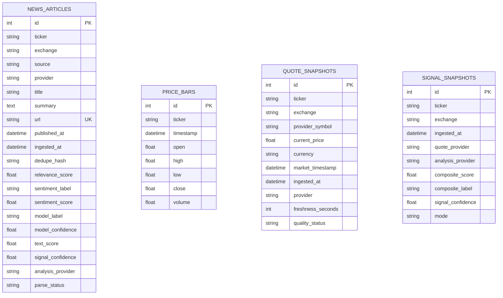

# Database V1 Reference

This document records the persistence layer that existed before Phase 5. It is a reference for compatibility and migration; it is not the target research schema.

## V1 Tables

## Schema Notes

- SQLAlchemy metadata lives in `finsent/app/database/entities.py`.
- Database engine/session initialization lives in `finsent/app/database/base.py`.
- Runtime repositories live in `finsent/app/database/repository.py`.
- Default SQLite path is `data/finsent.db` from `DATABASE_URL=sqlite:///data/finsent.db`.
- Tables are created with `Base.metadata.create_all`.
- V1 had small additive SQLite migrations for older `news_articles` columns.
- V1 had no schema version table.

## Integrity And Indexes

- `news_articles.url` is unique.
- `news_articles.dedupe_hash` is indexed but not unique.
- `price_bars` is unique by `(ticker, timestamp)`.
- `quote_snapshots` is unique by `(ticker, exchange, provider, market_timestamp)`.
- Most query-facing time, ticker, exchange, source, provider, label, and status columns are indexed.
- V1 has no foreign keys between articles, instruments, quotes, bars, signals, or research runs.

## Current Write Paths

- `NewsRepository.upsert_news_with_sentiment` checks `dedupe_hash` first, then `url`, and updates compatibility sentiment columns on `news_articles`.
- `PriceRepository.upsert_price_bars` updates or inserts by ticker/timestamp.
- `QuoteSnapshotRepository.upsert_quote_snapshot` inserts quote snapshots.
- `SignalSnapshotRepository.upsert_signal_snapshot` inserts Signal V1 snapshots.
- `IntelligenceService.run` opens one session, writes quote/news/bars/signal rows, then commits once.
- CSV import utilities in `kaggle_data.py` commit per imported ticker.

## Timestamp Conventions

V1 used naive Python `datetime` values that represent UTC in most active paths. CSV import uses `pd.to_datetime(..., utc=True).dt.tz_convert(None)` for historical dates. This is consistent enough for local SQLite but not fully explicit about timezone provenance.

## V1 Limitations

- Instruments are stored as repeated ticker/exchange strings.
- Articles assume one primary ticker even though news can mention multiple instruments.
- Article sentiment columns are overwritten compatibility fields, not immutable model-run history.
- Signal snapshots cannot cleanly store Signal V1 and future V2 side by side.
- Event-study results are not persisted.
- Provider health was process-local only before Phase 5.
- Dataset provenance is implicit in filenames and import paths.
