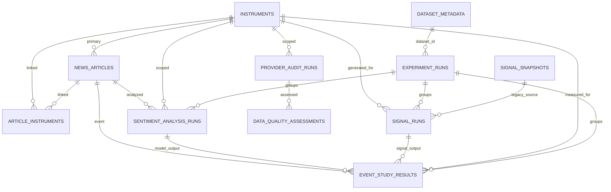

# Database V2

Phase 5 turns FinSent's SQLite database into an additive research storage foundation. It does not change Signal Engine V1 formulas, event-study matching, provider selection, or dashboard layout.

## Principles

1. Normalize where useful.
2. Prefer additive migrations over destructive rewrites.
3. Preserve provenance.
4. Make research runs reproducible.
5. Keep model outputs immutable where practical.
6. Store timestamps consistently as naive UTC representation unless uncertainty is documented.
7. Keep deterministic dedupe central.
8. Store no raw secrets.
9. Store no fake data.
10. Keep the existing dashboard and pipeline compatible.

## ER Diagram

## Schema Version

- Current version: `2`.
- Stored in `schema_metadata` as `key='schema_version'`.
- Fresh databases create the latest schema directly.
- Existing SQLite databases are upgraded by additive migration in `apply_sqlite_migrations`.
- Migration is idempotent and uses no destructive drops.
- Before migrating the local runtime DB during Phase 5, a filesystem backup copy was created.

## V2 Entities

- `schema_metadata`: stores schema version and future lightweight metadata.
- `instruments`: canonical instrument identity for the current project universe.
- `article_instruments`: junction table for future multi-instrument articles.
- `experiment_runs`: reproducible research execution grouping.
- `sentiment_analysis_runs`: immutable model output history for one article/instrument/model/experiment.
- `signal_runs`: future-proof signal storage for V1 and later V2 without fake component fields.
- `event_study_results`: storage for later event-study results, including exact matched timestamps and validity state.
- `provider_audit_runs`: persistent provider call/result metadata without raw API bodies.
- `data_quality_assessments`: reusable quality snapshots associated with a subject type/id.
- `dataset_metadata`: explicit registry for local CSV/reference datasets.

## Compatibility Columns

V1 tables remain active. Phase 5 adds nullable columns such as:

- `news_articles.instrument_id`, `canonical_url`, `original_url`, `publisher`, `source_provider`, `leaf_provider`, `data_mode`, `raw_symbol`.
- `price_bars.instrument_id`, `provider`, `dataset_id`, `data_mode`, `quality_status`.
- `quote_snapshots.instrument_id`, `leaf_provider`, `data_mode`, `freshness_label`, data-quality summary fields.
- `signal_snapshots.instrument_id`, `engine_name`, `engine_version`, `experiment_id`.

Existing dashboard queries still read the same compatibility fields as before.

## Index Strategy

Indexes are focused on expected access paths:

- article time, ticker/exchange, dedupe hash, provider, canonical URL, instrument
- instrument canonical symbol and exchange/display symbol
- model runs by article/model and experiment/model/time
- signal runs by instrument/engine/time and experiment/engine
- event-study results by instrument/horizon/event time and status
- provider audits by provider/status/time and service/time
- dataset id and dataset status

Speculative heavy indexing was avoided.

## Integrity Rules

- `instruments.canonical_symbol` is unique.
- `(instruments.exchange, instruments.display_symbol)` is unique.
- `article_instruments` is unique by article, instrument, and association source.
- V1 URL uniqueness remains for compatibility, while deterministic `dedupe_hash` remains the preferred article identity input.
- Repeated model runs and repeated experiments are allowed.
- Signal V1 and future signal versions can coexist in `signal_runs`.

## Timestamp Policy

- Persistence uses naive UTC representation for generated/created/fetched timestamps.
- `published_at`, `source_timestamp`, `fetched_at`, `ingested_at`, `generated_at`, and `created_at` remain distinct concepts.
- Local CSV dates are normalized from UTC-aware parsing to naive UTC representation.
- Unknown exchange/session semantics are not silently inferred.
- Exchange-calendar logic remains deferred.

## Data Quality

Provider audit rows store quality summary fields for common questions. Detailed quality snapshots are stored in `data_quality_assessments` with score, label, reasons JSON, freshness, provider, mode, and evaluated time.

Data quality is intentionally separate from model confidence.

## Storage Size Policy

SQLite remains appropriate for the six-month university project because Phase 5 stores metadata, normalized records, and compact research outputs, not raw payload archives. Full external API bodies, duplicate full article bodies, secrets, and credential-bearing URLs are intentionally excluded.
