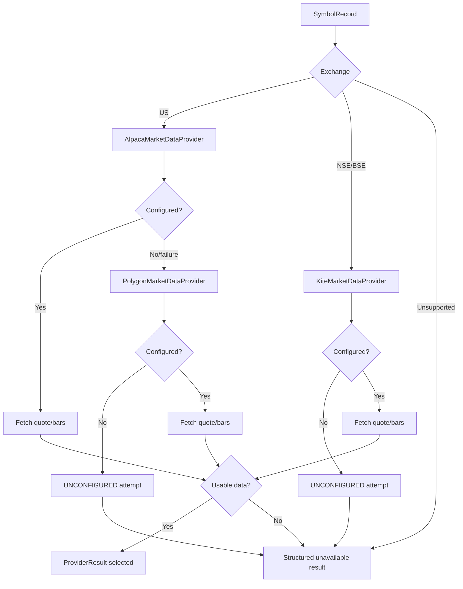
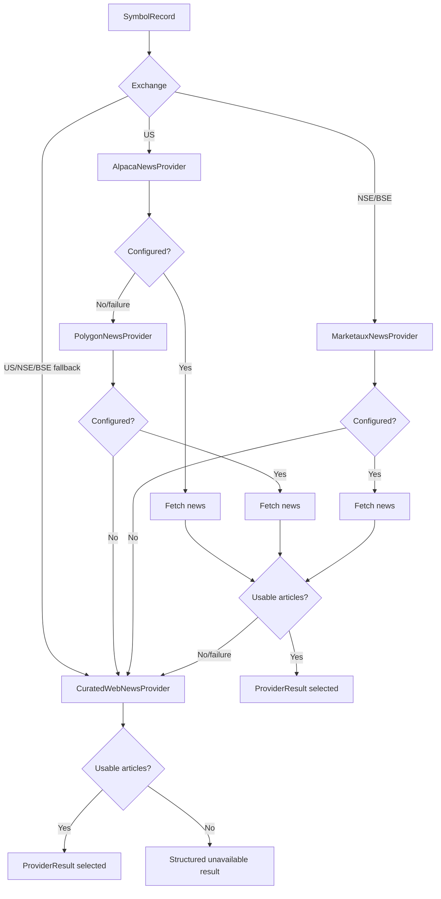

# FinSent Provider Architecture

Phase 3 consolidated the active provider path. Later phases made Alpaca the primary US live demo provider and added reliability/data-quality metadata without changing locked research artifacts.

## Goals

- One understandable active path for quotes, historical bars, and news.
- Deterministic market-aware provider routing for `US`, `NSE`, and `BSE`.
- Explicit fallback semantics for unconfigured, failed, unsupported, and no-data providers.
- Normalized FinSent domain models at the application boundary.
- Safe provider status, provenance, and attempt traces without storing raw API responses.

## Provider Contracts

Contracts live in `finsent/app/services/provider_contracts.py`.

- `ActiveMarketDataProvider`: fetches a normalized `QuoteSnapshot`.
- `ActiveHistoricalDataProvider`: fetches normalized OHLCV bars as a DataFrame.
- `ActiveNewsProvider`: fetches normalized `NormalizedNewsArticle` rows.
- `ProviderCandidate`: describes provider name, service, supported exchanges, configuration check, factory, and unconfigured message.

Existing provider classes are retained. The active runtime now reaches them through routers.

## Normalized Domain Models

Market quote model:

- `QuoteSnapshot`
- key fields: symbol, exchange, provider symbol, current price, bid/ask, spread, volume, timestamp, provider, freshness, quality, note, `ProviderStatus`.

Historical bars:

- Pandas DataFrame with `Open`, `High`, `Low`, `Close`, `Volume` indexed by timestamp.
- Empty DataFrame means no usable historical bars.

News:

- `NormalizedNewsArticle`
- key fields: article id, ticker, exchange, source, title, summary, URL, publication time, provider, dedupe hash, relevance score, provider status.

## Market Routing

Market routing lives in `MarketDataRouter`.

Current market-data chains:

- US quote/bars: Alpaca -> Polygon -> structured unavailable.
- NSE/BSE quote/bars: Kite -> structured unavailable.
- Alpaca normally uses `ALPACA_FEED=iex`; this is not consolidated SIP.
- Polygon has internal quote fallbacks: snapshot -> last trade -> previous close.
- Kite can resolve instruments through its instrument cache for bars.

Older yfinance market logic remains in deprecated modules; it is not the active provider-router path.

## News Routing

News routing lives in `NewsProviderRouter`.

Current news chains:

- US: Alpaca/Benzinga news -> Polygon news -> Marketaux -> fallback web -> unavailable.
- NSE/BSE: Marketaux -> fallback web -> unavailable.
- Fallback web currently delegates to `YahooFinanceScraper`.
- `YahooFinanceScraper` internally attempts Gemini search, Alpaca news, yfinance news, then Yahoo HTML scraping.

Gemini sentiment analysis is separate from news acquisition and is not part of the news router.

## Historical Data Routing

Active live historical bars:

- US: Alpaca bars first, then Polygon aggregate bars if configured.
- NSE/BSE: Kite historical candles.

Offline/local historical import remains separate:

- NSE archive CSVs use `kaggle_data.load_nse_price_frame`.
- US daily CSV uses `kaggle_data.load_us_price_frames`.
- Git LFS pointer detection remains active and rejects pointer text before parsing.

Historical provenance categories:

- `PROVIDER`: live Polygon/Kite bars through `MarketDataRouter`.
- `LOCAL_DATASET`: offline CSV import utilities.
- `UNAVAILABLE`: empty routed provider result or missing local file.

No new historical data source is invented in Phase 4.

## ProviderStatus

`ProviderStatus` remains the compact provider state model:

- `AVAILABLE`
- `DEGRADED`
- `UNAVAILABLE`
- `UNCONFIGURED`
- `STALE`

It carries provider, service, message, configured/available flags, stale flag, source timestamp, and checked-at timestamp.

## ProviderResult

`ProviderResult[T]` wraps routed provider calls.

Fields:

- `data`
- `status`
- `provider`
- `service`
- `source_timestamp`
- `fetched_at`
- `from_cache`
- `fallback_used`
- `attempts`
- `message`
- `leaf_provider`
- `data_mode`
- `freshness`
- `quality`
- `retry_after_seconds`

`data=None` is not treated as success. Empty historical/news results are unavailable/no-data outcomes unless a provider returns usable rows.

Phase 4 adds `DataQualityAssessment`, `DataMode`, `FreshnessLabel`, in-memory TTL cache entries, and current-session provider health in `provider_reliability.py`.

## Failure Categories

Failure categories live in `ProviderFailureCategory`.

- `UNCONFIGURED`
- `AUTHENTICATION`
- `RATE_LIMIT`
- `TIMEOUT`
- `NETWORK`
- `INVALID_RESPONSE`
- `NO_DATA`
- `STALE_DATA`
- `UNSUPPORTED_SYMBOL`
- `UNKNOWN`

HTTP 401/403 map to authentication, 429 maps to rate limit, request timeouts map to timeout, connection errors map to network, and malformed deterministic responses map to invalid response.

## Fallback Semantics

- Unsupported providers are skipped for the exchange.
- Unconfigured providers are recorded as `UNCONFIGURED` and not called.
- Configured providers are attempted in deterministic order.
- Failed providers produce classified attempts and the router moves to the next compatible candidate.
- Providers returning unusable quote/no articles/no bars produce `NO_DATA` attempts.
- If no candidate succeeds, the router returns a structured unavailable result.

## Cache/Freshness Semantics

- Router results include `from_cache`.
- Router-level in-memory TTL cache is active for quotes, news, and historical bars.
- Quote freshness remains on `QuoteSnapshot.freshness_seconds`.
- Stale quote state remains explicit through `quality_status="stale"` and `ProviderStatus.STALE`.
- Stale cached fallback is returned as `STALE`, not fresh live data.
- Kite instrument-token cache remains an implementation detail of `KiteMarketDataProvider`.
- Legacy/local CSV imports are not labeled as live provider data.

## Provenance

Every routed result exposes:

- final provider,
- leaf provider,
- data mode,
- service,
- source timestamp where known,
- whether fallback was used,
- full lightweight `ProviderAttempt` trace.

The app does not persist full raw API responses or secret-bearing request URLs.

## Adding a New Provider

1. Implement the relevant active provider method:
   - quote: `fetch_quote_snapshot`
   - bars: `fetch_price_bars`
   - news: `fetch_news`
2. Normalize output into `QuoteSnapshot`, OHLCV DataFrame, or `NormalizedNewsArticle`.
3. Return explicit unavailable/status information instead of fake zero values.
4. Add a `ProviderCandidate` to the appropriate default candidate list.
5. Add tests for configured, unconfigured, failure, no-data, and successful paths.

## Current Active Providers

| Provider | Service | Exchanges | Configuration | Active path |
|---|---|---|---|---|
| Alpaca | quotes/bars/news | US | `ALPACA_API_KEY`, `ALPACA_API_SECRET` | Router primary for US live demo |
| Polygon | quotes/bars/news | US | `POLYGON_API_KEY` | Optional fallback for US market/news |
| Kite | quotes/bars | NSE/BSE | `KITE_API_KEY`, `KITE_ACCESS_TOKEN` | Router primary for India market |
| Marketaux | news | US/NSE/BSE | `MARKETAUX_API_TOKEN` | Optional news fallback |
| Fallback web | news | US/NSE/BSE | optional nested configs | Router fallback for news |

## Legacy Providers

| Component | Status | Notes |
|---|---|---|
| `finsent/app/services/market_data.py` | LEGACY | Older market logic. Not active in provider router. |
| `finsent/app/services/sentiment.py` | RESEARCH / KEEP FOR NOW | FinBERT and old sentiment services for future comparison. |
| yfinance/Yahoo inside `YahooFinanceScraper` | fallback implementation detail | Active only beneath fallback web. |

## Known Limitations

- Provider audit rows exist for real provider attempts, but raw API payload archiving is intentionally not implemented.
- Router-level cache is in-memory only; it is not persisted across application restarts.
- Market fallback does not activate legacy yfinance market code.
- Provider health is current-session in the dashboard; provider audit rows store real provider attempts separately.
- Provider status, quote mode, and data-quality labels are surfaced compactly in System Status rather than a separate full observability product.
