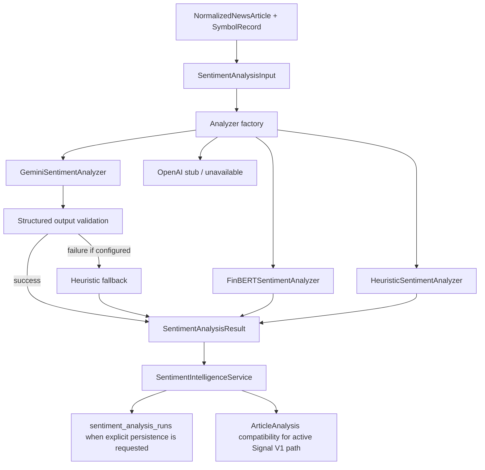

# Sentiment Intelligence V2

Phase 6 introduces a model-agnostic sentiment execution layer. It does not run a Gemini-vs-FinBERT benchmark, change Signal Engine V1, or fix event-study matching.

## Architecture

## Canonical Input

`SentimentAnalysisInput` contains only normalized article and instrument context:

- article id and instrument id where known
- symbol, exchange, company name
- title, summary, optional body
- publisher and published timestamp
- source provider, leaf provider, data mode
- optional language
- context metadata such as dedupe hash or source relevance score

The input is usable by Gemini, FinBERT, heuristic fallback, and future analyzers.

## Canonical Result

`SentimentAnalysisResult` records:

- requested and actual analyzer
- provider, model family, model name, model version
- analysis method
- canonical sentiment label and score
- confidence, relevance, impact strength
- time horizon and catalyst tag where applicable
- short reason where genuinely produced
- parse status, fallback flag, fallback reason
- schema and prompt version
- latency and created timestamp
- execution status and failure category
- safe structured metadata

## Sentiment Scale

Canonical sentiment score uses `[-1.0, +1.0]`:

- negative values: bearish
- `0.0`: neutral
- positive values: bullish

Gemini and heuristic results use label direction with confidence magnitude. FinBERT uses `P(positive) - P(negative)`.

## Taxonomies

Catalysts:

- `earnings`
- `guidance`
- `m_and_a`
- `regulation`
- `litigation`
- `product`
- `partnership`
- `analyst_rating`
- `management`
- `layoffs`
- `financing`
- `macro`
- `other`
- `unknown`
- `not_applicable`

Time horizons:

- `intraday`
- `1-3d`
- `1-2w`
- `unknown`
- `not_applicable`

FinBERT uses `not_applicable` for catalyst and horizon because the base classifier does not produce those fields.

## Fallback Policy

The active Gemini dashboard path remains:

1. Request Gemini.
2. If Gemini is unconfigured, provider-fails, or parse-fails, use heuristic fallback.
3. Expose requested analyzer, actual analyzer, fallback flag, and fallback reason.

FinBERT is not automatically used as a fallback for Gemini.

## Persistence Policy

`sentiment_analysis_runs` is the research source of truth. Article compatibility fields remain the current active-pipeline/latest-result surface for the dashboard.

Explicit research executions through `SentimentIntelligenceService` or `run_sentiment_analysis.py` can persist model runs. The normal dashboard path does not blindly create repeated research rows for every refresh.

## Failure Taxonomy

Model failures use:

- `UNCONFIGURED`
- `DEPENDENCY_MISSING`
- `AUTHENTICATION`
- `RATE_LIMIT`
- `TIMEOUT`
- `NETWORK`
- `INVALID_RESPONSE`
- `PARSE_FAILURE`
- `MODEL_LOAD_FAILURE`
- `INFERENCE_FAILURE`
- `UNKNOWN`

Provider-style HTTP exceptions are mapped where the meaning matches.
