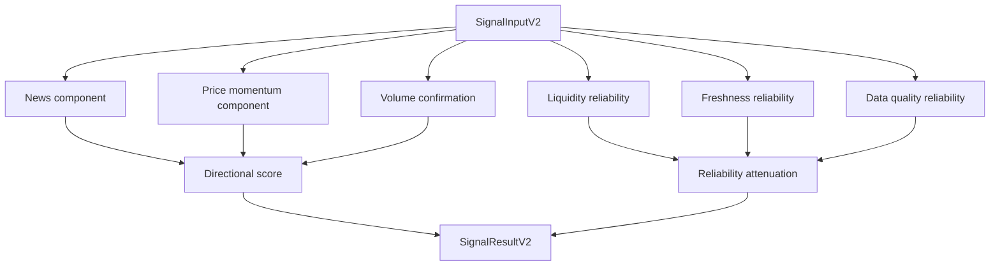

# Signal Engine V2

Phase 7 adds a new deterministic, explainable signal engine. Signal Engine V1 remains available and remains the dashboard default.

## Purpose

Signal V2 combines directional evidence from:

- news intelligence
- price momentum
- volume confirmation

Reliability evidence then attenuates confidence and score magnitude:

- liquidity/spread
- freshness
- data quality
- component agreement

V2 does not provide investment advice, trading execution, calibrated probabilities, or optimized weights.

## Architecture



## Engine Identity

- `engine_name`: `finsent_composite`
- `engine_version`: `2.0`

Phase 13 adds a frozen research-only configuration identifier:

- `engine_version`: `2.1-research`
- status: `FROZEN_RESEARCH_CANDIDATE_NOT_JUSTIFIED`

This does not replace V2.0 and is not the dashboard default.

## Score Range

Final score is bounded:

```text
-1.0 = strongly bearish
 0.0 = neutral
+1.0 = strongly bullish
```

## Weights

These are engineering priors, not statistically optimized weights:

| Component | Weight |
|---|---:|
| News | 0.55 |
| Price momentum | 0.35 |
| Volume confirmation | 0.10 |

Reliability components have no directional weight.

The Phase 13 research candidate keeps the same engine mechanics and changes only the permitted directional-combination inputs: news weight, momentum weight, volume-confirmation weight, and symmetric directional threshold. Strong thresholds, confidence, momentum normalization, news decay, FinBERT, Event Study V2, and Signal V1 remain unchanged.

## Directional Formula

Available directional components are safely renormalized:

```text
raw_score = sum(component.normalized_value * component.weight) / sum(available_directional_weights)
```

Then reliability attenuates magnitude:

```text
final_score = clamp(raw_score * attenuation, -1, 1)
attenuation = average(liquidity_reliability, freshness_reliability, data_quality_reliability)
```

Minimum attenuation is `0.25`, so weak data reduces the signal toward neutral without flipping direction.

## Labels

| Score range | Label |
|---|---|
| `>= 0.55` | `strong_bullish` |
| `>= 0.20` | `bullish` |
| `<= -0.55` | `strong_bearish` |
| `<= -0.20` | `bearish` |
| otherwise | `neutral` |

## Confidence

Confidence is an engineering reliability score, not a probability.

```text
confidence =
  0.35 * abs(final_score)
+ 0.30 * average(component reliability)
+ 0.20 * component agreement
+ 0.15 * directional component availability
```

Labels:

- `high`: `>= 0.70`
- `medium`: `>= 0.40`
- `low`: otherwise

## Degradation

V2 degrades gracefully:

- no news: market-only if bars exist
- no bars: news-only if news exists
- no volume: volume confirmation unavailable
- no bid/ask: liquidity warning and confidence reduction
- stale/low-quality data: magnitude and confidence attenuation
- no inputs: `INSUFFICIENT_DATA`

## V1 vs V2

V1 is a compact deterministic compatibility engine. V2 is componentized, explainable, and separates direction from reliability. V2 is explicitly selectable for research and local testing; it is not promoted to default dashboard behavior in Phase 7.

## Persistence

V2 uses existing Phase 5 `signal_runs`. Component breakdown is stored as structured JSON in `future_component_json`; no DB schema change was required.

## Limitations

- Weights are not backtest-optimized.
- Confidence is not calibrated.
- Event-study defects are still unresolved.
- No sector-relative or macro-regime context.
- No RSI/MACD/Bollinger indicator stack.
- No trading instruction semantics.
