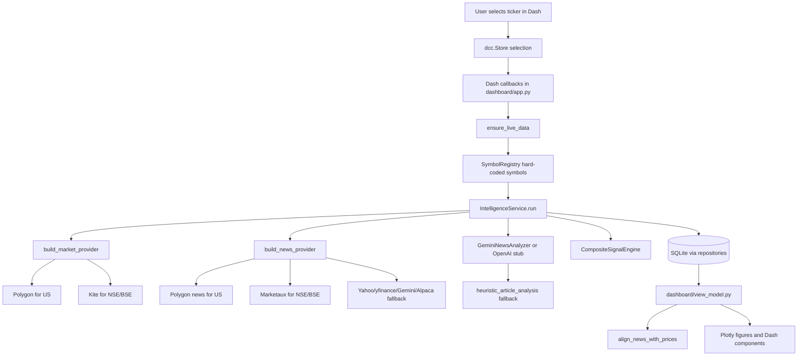
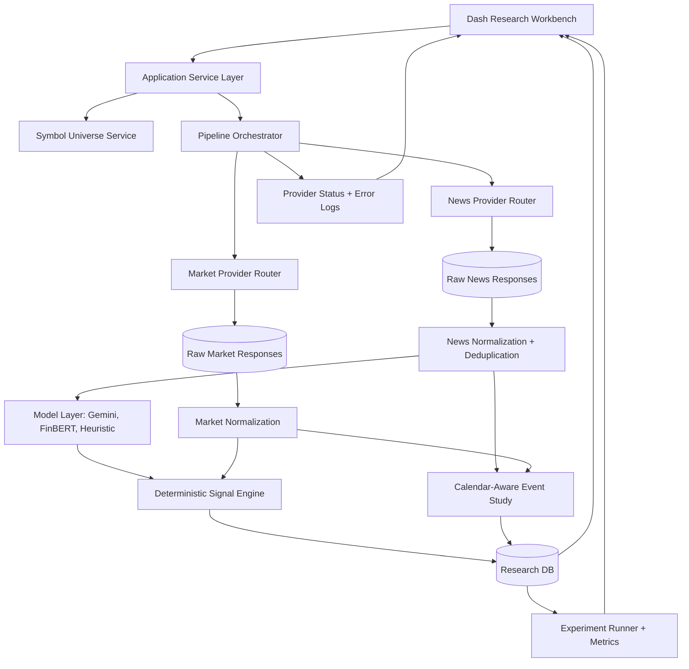

# FinSent V2 Baseline Audit

## Executive Summary

FinSent is currently a local Dash-based financial news and market-signal application with a newer Gemini/provider architecture layered on top of older Yahoo/yfinance/FinBERT-oriented code. It is not a throwaway prototype, but it is still early as a defensible research platform.

Current health score: 47/100.

The strongest parts are the existence of a real package structure, deterministic signal code, provider normalization attempts, SQLite persistence, a working Dash app, and a passing focused test suite. The weakest parts are research validity, provider observability, event-study correctness, dependency reproducibility, stale/outdated documentation, and a UI that overstates analytical precision.

Phase 0 did not modify application source code. Local setup created `.venv`, installed runtime dependencies plus `pytest`, initialized `data/finsent.db`, and produced this documentation.

## What FinSent Currently Does

The active app lets a user select a ticker from a small hard-coded universe, refreshes local/live provider data, analyzes recent news with Gemini or a heuristic fallback, stores quotes/news/signals in SQLite, and renders Dash pages for:

- Summary
- News impact
- Compare
- Alerts

The current active universe is 20 hard-coded symbols:

- US: AAPL, AMZN, MSFT, NVDA, META, GOOGL, TSLA, JPM
- NSE: RELIANCE, TCS, INFY, HDFCBANK, ICICIBANK, SBIN, ITC
- BSE: RELIANCE, TCS, INFY, HDFCBANK, SBIN

Large CSV universe files exist, but the active dashboard selector does not use them.

## Current Technology Stack

- Python 3.13.13 in the local environment
- Dash 2.18.2
- dash-bootstrap-components 1.6.0
- Plotly 6.9.0 as installed transitively
- Pandas 2.2.3
- NumPy 2.2.4
- Requests
- BeautifulSoup
- SQLAlchemy 2.0.40
- SQLite
- yfinance 0.2.54
- torch 2.6.0
- transformers 4.49.0
- python-dotenv
- Google Gemini REST API through `requests`
- Provider integrations for Polygon, Kite, Marketaux, Alpaca, Yahoo/yfinance, Gemini search fallback

## Repository Structure

Observed root: `LY-project-main`.

Important directories:

- `finsent/app/config`: environment-based settings
- `finsent/app/services`: provider, sentiment, signal, intelligence, data-import logic
- `finsent/app/database`: SQLAlchemy base, entities, repositories
- `finsent/app/analysis`: market-impact/event-study alignment
- `finsent/app/dashboard`: Dash app, callbacks, pages, CSS assets
- `finsent/app/scrapers`: Yahoo/yfinance fallback scraping
- `finsent/scripts`: run dashboard, run pipeline, import Kaggle data
- `finsent/tests`: 10 focused tests across 3 test files plus package init
- `archive/v1`: 1,940 NSE historical price CSV files, about 671.55 MB
- `docs`: existing project report outputs and the new audit documents
- `scripts`: presentation-generation script with hard-coded non-local paths
- `generated_ppt_assets`: generated presentation images
- `data`: local runtime data directory; Phase 0 created `data/finsent.db`

Generated/temp artifacts:

- `.DS_Store` files are present.
- `tmp_screenshot_contact.jpg` is present at project root.
- `.pytest_cache` and `__pycache__` folders were generated during baseline checks. A cleanup command was blocked by execution policy, so they remain ignored artifacts.

Unusually large items:

- `archive/v1`: about 671.55 MB
- `FinSent_KJSSE_Presentation_Pro.pptx`: about 7.43 MB
- `FinSent_KJSSE_Template_Presentation.pptx`: about 6.88 MB

## Active Runtime Architecture

Execution begins with:

- Dashboard: `python -m finsent.scripts.run_dashboard`
- Pipeline CLI: `python -m finsent.scripts.run_pipeline --ticker AAPL --limit 15`

The dashboard route starts with a landing page. Analysis pages are hidden until a ticker is loaded. Selecting a ticker calls `ensure_live_data`, which may call the full provider/analysis pipeline.

## Data Flow

1. UI stores selection in `dcc.Store`.
2. `ensure_live_data` checks whether quote/news/price data needs refresh.
3. Symbol string resolves through `SymbolRegistry`.
4. `IntelligenceService.run` initializes the DB, selects providers, fetches quote, price bars, and news.
5. News is deduplicated in memory by `dedupe_hash`.
6. Article analysis comes from cached DB rows, Gemini, or heuristic fallback after LLM budget is reached.
7. Aggregate analysis is computed in `GeminiNewsAnalyzer.aggregate`.
8. `CompositeSignalEngine.compute` produces the final deterministic signal.
9. Repositories persist normalized news, price bars, quote snapshots, and signal snapshots.
10. The dashboard reads DB data through `load_live_data`.
11. `build_dashboard_state` filters, widens sparse news windows, aligns news to prices, builds compare/sector frames, and renders Plotly figures.

## Active vs Legacy Components

| Component | Status | Evidence |
|---|---:|---|
| `IntelligenceService` | Active | Called by `ensure_live_data` and `FinSentPipeline` |
| `market_providers.py` | Active | Builds Polygon/Kite market providers |
| `news_providers.py` | Active | Builds Polygon/Marketaux/fallback news providers |
| `llm_analyzers.py` | Active | Builds Gemini analyzer and OpenAI stub |
| `signal_engine.py` | Active | Current composite signal owner |
| `dashboard/app.py` and `view_model.py` | Active | Main Dash runtime |
| SQLAlchemy repositories/entities | Active | DB persistence and reads |
| `analysis/market_impact.py` | Active | Used by pipeline and dashboard event frames |
| `scrapers/yahoo_finance.py` | Fallback active | Used by `CuratedWebNewsProvider` |
| `services/market_data.py` | Legacy/deprecated | File states it is deprecated; no active runtime reference except direct imports/tests absent |
| `services/sentiment.py` | Legacy/deprecated | Contains FinBERT and old Gemini sentiment; active runtime uses `llm_analyzers.py` |
| `services/kaggle_data.py` | Utility/offline | Used only by import script, not live dashboard selection |
| `scripts/build_presentation.py` | Presentation utility | Not part of app runtime; has hard-coded old author paths |

## Market Data Architecture

Active provider selection:

- US symbols use `PolygonMarketDataProvider`.
- NSE/BSE symbols use `KiteMarketDataProvider`.
- Unknown exchanges use `UnavailableMarketProvider`.

Polygon:

- Requires `POLYGON_API_KEY`.
- Quote flow uses `/v2/snapshot/...`, then falls back to `/v2/last/trade`, then `/v2/aggs/.../prev`.
- Price bars use aggregates endpoint with interval mapping for `1d`, `30m`, `15m`, `5m`.
- Errors are partially handled: quote exceptions degrade to fallbacks; bars return empty frames on request exceptions.
- No explicit rate-limit handling beyond request exceptions.

Kite:

- Requires `KITE_API_KEY` and `KITE_ACCESS_TOKEN`.
- Quotes use `/quote`.
- Historical bars require resolving an instrument token via `/instruments`, with class-level in-memory cache.
- Supports `day`, `60minute`, `30minute`, `15minute`, `5minute`, `minute`.
- `KITE_API_SECRET` is configured but not used in active requests.
- No token refresh flow exists.

Legacy market provider:

- `MarketDataService` uses Alpaca if configured, otherwise yfinance.
- It computes volume ratio, buy/sell ratio, spread penalty, and market signal, but this is not active in the current dashboard path.

Confirmed provider architecture issue:

- The active signal engine does not use historical price behavior, volume ratio, or buy/sell ratio from the current market providers. It uses quote existence/quality, spread percentage, and freshness only.

## News Architecture

Active provider selection:

- US with `POLYGON_API_KEY`: Polygon news.
- US without `POLYGON_API_KEY`: curated web fallback.
- NSE/BSE with `MARKETAUX_API_TOKEN`: Marketaux.
- NSE/BSE without token: curated web fallback.

Polygon news:

- Requires API key.
- Normalizes `title`, `article_url`, publisher name, description, `published_utc`, and relevance 1.0.
- Does not locally catch request exceptions; failures bubble to `IntelligenceService` and are silently swallowed by `ensure_live_data` in dashboard mode.

Marketaux:

- Requires token.
- First searches by symbol candidates such as `TCS.NS`; falls back to company name search.
- Filters by entity relevance.
- Does not explicitly handle rate limits, stale data, or retry/backoff.

Curated fallback:

- Uses `YahooFinanceScraper`.
- The scraper tries Gemini search first when configured, then Alpaca news if configured, then yfinance news, then Yahoo HTML scraping.
- This means the class name understates its real behavior: it is not only Yahoo Finance.

Deduplication:

- Runtime in-memory dedupe sorts by published time and removes repeated `dedupe_hash`.
- Database uniqueness is on `url`, not `dedupe_hash`; duplicate content on different URLs can persist.

## AI / Sentiment Architecture

Active AI path:

- `build_llm_analyzer` returns `GeminiNewsAnalyzer` unless `SENTIMENT_PROVIDER=openai`.
- `OpenAIAnalyzerStub` is a stub and does not call OpenAI.
- FinBERT is not active in the current dashboard/pipeline path.

Gemini article prompt:

- Stock-specific short-term market impact prompt.
- Requests strict JSON with fields: relevance, bullish/bearish/neutral sentiment, confidence, impact strength, time horizon, catalyst tag, short reason.
- Does not use search grounding for per-article analysis.

Gemini failure behavior:

- If no key is configured, heuristic fallback is used.
- If request/parse fails, heuristic fallback is used with parse-status tags.
- LLM per-refresh budget is controlled by `LLM_ANALYSIS_LIMIT`; after that, heuristic fallback is used.

Heuristic fallback:

- Uses positive/negative/high-impact keyword sets.
- Estimates relevance from ticker/company-name match or provider relevance.
- Confidence and impact are capped/scaled by relevance, term hits, provider relevance, and article age.
- Catalyst classification is keyword based.

Legacy sentiment path:

- `FinBERTSentimentService` loads `ProsusAI/finbert` by default.
- `GeminiSentimentService` classifies positive/negative/neutral probabilities.
- `build_sentiment_service` would fall back to FinBERT when Gemini is not keyed, but this function is not used by active runtime.

Research implication:

- The repository has material for Gemini vs FinBERT comparison, but no active experiment harness, paired evaluation dataset, or side-by-side UI currently exists.

## Signal Engine Analysis

Active formula in `CompositeSignalEngine.compute`:

For each article:

- `recency_weight = max(0.2, 1.0 - min(age_hours / 72.0, 0.8))`
- `direction = 1.0` for bullish, `-1.0` for bearish, `0.0` for neutral
- `weight = recency_weight * confidence * impact_strength`
- `news_score = sum(direction * weight) / sum(weight)` when total weight is positive

Quote penalties:

- `liquidity_penalty = min(spread_percentage / 0.01, 1.0)` when spread exists
- `freshness_penalty = min((freshness_seconds - 300) / 1800.0, 1.0)` when quote is older than 300 seconds

Market component:

- `market_component = 0.1` only when quote quality is `live` and current price exists.
- `market_component = 0.0` for delayed/stale quotes even if price exists.

Composite score:

- `composite_score = clamp((0.75 * news_score) + (0.25 * market_component) - (0.10 * liquidity_penalty) - (0.10 * freshness_penalty), -1.0, 1.0)`

Confidence:

- `signal_confidence = clamp(aggregate.overall_confidence - (0.1 * freshness_penalty), 0.0, 1.0)`

Labels:

- `bullish` if score > 0.18
- `bearish` if score < -0.18
- otherwise `neutral`

Phase 2 mode labels:

- `News + Quote Quality` when a usable quote and article pairs exist.
- `Quote-quality fallback` when a usable quote exists and no article pairs exist.
- `News-only signal` when no usable quote and article pairs exist.
- `Unavailable` when neither usable quote nor article pairs exist.

Phase 2 usable quote criteria:

- valid positive current price
- valid market timestamp
- quality status of `live`, `delayed`, or `stale`
- provider status not `UNCONFIGURED` or `UNAVAILABLE`

Confirmed mismatch:

- Active market contribution is not a true market-behavior model. It mostly checks usable quote availability, quote quality, spread, and freshness. Phase 2 corrected active dashboard copy, but generated report/presentation artifacts may still contain older wording until regenerated.

## Market Impact / Event Study Analysis

Current event-study function:

- Converts `published_at` and price `timestamp` with `pd.to_datetime`.
- Uses `pd.merge_asof` backward from news time to last prior price.
- Allows entry match tolerance of two days.
- Sets target time to `market_timestamp + return_window_minutes`.
- Uses `pd.merge_asof` forward from target time to future price.
- Allows future match tolerance of `max(return_window_minutes, two days)`.
- Computes `(future_close - entry_close) / entry_close`.

Confirmed research-validity issue:

- A label such as "60 minute return" can use entry or exit observations up to two days away. This is not a strict 60-minute event window.

Missing event-study controls:

- No exchange calendar.
- No market hours handling.
- No before-open/after-close policy.
- No weekend/holiday handling.
- No timezone policy beyond naive timestamp conversion.
- No maximum actual elapsed-time column.
- No distinction between exact, delayed, or extrapolated price linkage.
- No duplicate-article collapse at event-analysis time beyond earlier runtime dedupe.

## Database Assessment

SQLite schema created in Phase 0:

- `news_articles`
- `price_bars`
- `quote_snapshots`
- `signal_snapshots`

Strengths:

- SQLAlchemy models exist.
- Price bars have uniqueness on `(ticker, timestamp)`.
- News is indexed by ticker/source/time and contains sentiment/analysis metadata.
- Quote and signal snapshots are separate from articles.

Weaknesses:

- No migration tool such as Alembic.
- SQLite-only manual migration patching exists for `news_articles`.
- `news_articles` uniqueness is on URL only, not `(ticker, exchange, dedupe_hash)` or provider article ID.
- `quote_snapshots` uniqueness includes nullable `market_timestamp`; repeated unavailable snapshots can duplicate.
- No relationships or foreign keys tie news, analyses, signals, quotes, and price bars into a research dataset.
- No experiment/run table.
- No provider response audit table.
- Timestamps are mostly naive UTC with no explicit timezone column.
- No data-retention policy.
- `AnalysisRepository.upsert_article_analysis` is a no-op; caching is effectively embedded in `news_articles`.

## UI/UX Assessment

The current UI is functional but visually weak for a professional financial analytics platform.

Specific issues:

- Dark blue/slate palette dominates almost every surface.
- Radial gradients and layered backgrounds create a generic AI-template feel.
- Large 24-28px radii and pill-shaped navigation/buttons are overused.
- Card surfaces are everywhere: nav, landing search, headers, charts, metrics, explanations, controls.
- Glassmorphism/backdrop blur appears across major UI shells.
- Hero-style landing copy is marketing-like instead of analytical.
- Typography mixes Trebuchet/Gill Sans with Georgia, producing an editorial feel rather than a dense analytics product.
- Excessive whitespace and large cards reduce data density.
- Financial colors are not consistently semantic; green/orange/blue are used decoratively and analytically.
- Several UI strings overclaim active computation, especially around buy/sell ratio, order flow, market alignment, and "AI" explanations.
- Controls are mostly text dropdowns/buttons rather than dense tool controls.
- Page titles and supporting copy explain the app instead of behaving like an expert workspace.

Recommended future visual direction:

- Professional research terminal/workbench style.
- Compact top bar, left or top navigation, dense symbol controls.
- Neutral dark or light institutional palette with restrained accents.
- Tight metric tiles, audit/status badges, confidence and data-quality labels.
- Tables and charts prioritized over explanatory marketing copy.
- Candlestick/price panels, event markers, sentiment strips, provider/status tags.
- Clear distinction between observed impact, estimated impact, and unavailable impact.

## Testing Assessment

Existing tests:

- 10 tests passed after installing `pytest`.
- Coverage includes deterministic signal output, market-only mode, event return calculation, daily summary columns, news persistence into table, malformed Gemini JSON parsing, Kite bar normalization, India status banner, Marketaux normalization, and provider selection.

Warnings:

- 14 Python 3.13 deprecation warnings for `datetime.utcnow()` in tests.

Current test gaps:

- Provider request failures and rate limits.
- Polygon response edge cases.
- Kite token expiry and instrument resolution failures.
- Marketaux company-name fallback edge cases.
- Gemini quota, malformed JSON, and non-dict response in full pipeline context.
- FinBERT loading and comparison behavior.
- Signal boundaries under liquidity/freshness penalties.
- Event-study weekends, after-hours news, holidays, missing bars, delayed future bars.
- DB dedupe/uniqueness and repeated unavailable snapshots.
- Dashboard callback integration and route rendering beyond a basic HTTP 200 smoke.
- CLI smoke tests.
- Kaggle importer behavior against LFS pointer files.

## Dependency Assessment

`requirements.txt` is runtime-only and incomplete for all repository activities.

Pinned runtime dependencies installed successfully in `.venv` after two long timed-out full-install attempts and one targeted install of `dash-bootstrap-components`.

Confirmed dependency issues:

- `pytest` is required to run existing tests but is missing from `requirements.txt`.
- `scripts/build_presentation.py` imports `python-pptx` and `Pillow`, but these are not declared.
- Heavy ML dependencies `torch` and `transformers` are installed even though FinBERT is not active in the default pipeline.
- No lock file is present.
- No separate runtime/dev/research requirements are present.
- Python version is not specified.

Python 3.13 result:

- Runtime imports passed.
- Tests passed with `datetime.utcnow()` deprecation warnings.

## Configuration / Security Assessment

Configuration is centralized in `finsent/app/config/settings.py` and loaded from environment variables via `python-dotenv`.

Environment variables observed:

- `DATABASE_URL`
- `NEWS_SOURCE_BASE_URL`
- `SENTIMENT_PROVIDER`
- `NEWS_DISCOVERY_PROVIDER`
- `LIVE_DATA_PROVIDER`
- `POLYGON_API_KEY`
- `MARKETAUX_API_TOKEN`
- `KITE_API_KEY`
- `KITE_API_SECRET`
- `KITE_ACCESS_TOKEN`
- `ALPACA_API_KEY`
- `ALPACA_API_SECRET`
- `GEMINI_API_KEY`
- `OPENAI_API_KEY`
- cache TTLs and runtime limits

Security findings:

- No real secrets were found in project files during the scan.
- Test placeholder keys/tokens exist, but they are not real secrets.
- `.gitignore` excludes `.env`, `.env.example`, `.venv`, `__pycache__`, `.pytest_cache`, and `data/*.db`.
- There is no actual `.env.example` file in the project root despite `.gitignore` referencing it.
- Debug is false in `run_dashboard.py`.
- Some provider failures are hidden by `ensure_live_data`, making missing credentials and service failures hard to distinguish in UI.

## Performance / Caching Assessment

Current caching:

- DB-level article analysis reuse by `dedupe_hash`.
- Kite instrument cache in class memory.
- `load_company_universe` uses `lru_cache`.
- Runtime settings define quote/news/price/analysis cache TTLs.

Problems:

- Most TTL settings are not wired into provider-level caches.
- Dashboard refresh can trigger network work from callbacks.
- `ensure_live_data` loops selected tickers sequentially.
- Exceptions are swallowed, so slow/failing providers are hard to diagnose.
- Large archive imports commit ticker-by-ticker and may be slow for full dataset.

## Dataset / Repository Size Assessment

Datasets:

- `archive/v1`: 1,940 NSE CSV files, about 671.55 MB.
- `All_Indian_Stocks_listed_in_nifty500.csv`: Indian company universe.
- `6000 Largest Companies ranked by Market Cap.csv`: broad company universe.
- `SnP_daily_update.csv`: Git LFS pointer only in local copy, not actual data.

Runtime dependency:

- The active dashboard does not require the full archive to start.
- Offline import scripts can use `archive/v1`.
- The active hard-coded symbol registry does not use the universe CSVs.

Recommendation:

- Do not keep full archive data as normal source-control payload long-term.
- Keep a small sample fixture in repo.
- Add a documented dataset acquisition/import script.
- Treat full historical data as external reproducible artifact.

## Confirmed Bugs

1. `SnP_daily_update.csv` is a Git LFS pointer, not actual US price data, so US historical import is unusable in this local copy.
2. Event-study "60 minute" impact can match entry/exit prices up to two days away.
3. Active composite signal does not use real market price momentum, volume ratio, or buy/sell pressure. Phase 2 updated active UI wording and froze Signal V1 behavior before V2 changes.
4. `ensure_live_data` silently catches all exceptions, hiding code failures, missing credentials, and provider failures from the dashboard.
5. `pytest` is missing from declared dependencies, so tests cannot run after documented setup alone.
6. Presentation builder imports undeclared packages and hard-codes old absolute macOS paths.
7. FinBERT is present but inactive in the current runtime; there is no real Gemini vs FinBERT comparison despite future/project claims.
8. `news_articles` dedupe uniqueness is URL-based only; same content via different URLs can persist.
9. Quote snapshot uniqueness with nullable `market_timestamp` allows repeated unavailable rows in SQLite.
10. README describes the older Yahoo/yfinance V1 pipeline and does not reflect the active Polygon/Kite/Marketaux/Gemini architecture.

## Technical Debt

- Multiple provider generations coexist without an explicit boundary document.
- Active and legacy sentiment APIs use different labels and data models.
- SQLite schema is evolving through manual patches.
- Provider errors lack structured status propagation.
- Hard-coded symbol universe prevents broad research scaling.
- Research metrics are calculated in dashboard view-model code instead of a reusable experiment layer.
- UI text mixes product explanation, financial advice disclaimers, and model interpretation.
- No formal config schema validation.
- No provider response recording.
- No reproducible experiment runner.

## Research Strengths

- Combines financial news, sentiment, short-term signals, and price movement.
- Has an explainable deterministic signal layer rather than pure black-box output.
- Stores enough article-level fields to begin catalyst/time-horizon analysis.
- Includes both LLM and FinBERT-era code that can support comparison.
- Has historical NSE archive data for backtesting once cleaned.
- Has event-study scaffolding.

## Research Weaknesses

- No labeled evaluation dataset.
- No baseline comparison experiments.
- No strict event windows.
- No market calendar handling.
- No confidence calibration.
- No directional accuracy/backtest metrics.
- No paired Gemini-vs-FinBERT output table.
- No measurement of provider data quality.
- No statistical controls for sector/market movements.
- No reproducibility protocol.

## Top 10 Technical Problems

1. Event-study alignment is too loose for research claims.
2. UI and explanations overstate active market-signal logic.
3. Provider failures are silently swallowed.
4. Active architecture and README/documentation diverge.
5. FinBERT is legacy-only, not part of active comparative research.
6. Tests are useful but too narrow for provider, DB, and event-study edge cases.
7. Dependency setup is not fully reproducible without extra dev installs and long manual retries.
8. Database model lacks experiment/run/provenance structure.
9. Full archive data is large and not managed as a reproducible external artifact.
10. Hard-coded symbol registry limits scale and creates mismatch with CSV universe files.

## Top 10 Product / Research Opportunities

1. Build a strict event-study engine with calendars, horizons, and elapsed-time audit columns.
2. Add Gemini vs FinBERT side-by-side evaluation with agreement/disagreement metrics.
3. Create historical backtesting for directional accuracy and horizon-specific returns.
4. Add confidence calibration and reliability diagrams.
5. Add catalyst-specific impact analysis.
6. Add provider observability: source, quality, error state, freshness, provenance.
7. Replace UI marketing shell with a professional research terminal/workbench.
8. Add reproducible experiment runner and stored experiment results.
9. Expand symbol universe from controlled watchlist to configurable research universe.
10. Add benchmark comparisons against market/sector-relative returns.

## Recommended Target Architecture

## Recommended Long-Term Development Roadmap

Month 1:

- Freeze active/legacy boundaries.
- Fix configuration/dependency reproducibility.
- Add provider status/error models.
- Add strict event-study correctness.
- Create test fixtures and provider mocks.

Month 2:

- Introduce research database model: runs, experiments, model outputs, provider provenance.
- Build Gemini/FinBERT paired analyzer abstraction.
- Add deterministic backtest runner.
- Replace fragile event windows with exchange-aware calendars.

Month 3:

- Add model comparison dashboards.
- Add directional accuracy, return correlation, and calibration metrics.
- Add catalyst taxonomy and evaluation.
- Add full archive import strategy with sample fixtures.

Month 4:

- Redesign UI into a professional analytics workbench.
- Add dense tables, event timelines, price overlays, confidence panels, provider status.
- Separate observed impact from estimated impact everywhere.

Month 5:

- Expand provider architecture and fallback policies.
- Add caching, retries, rate-limit handling, and structured stale-data states.
- Add reproducible experiment scripts and report-generation outputs.

Month 6:

- Polish final demo path.
- Produce technical report, experiment results, ablations, limitations, and future work.
- Harden startup, tests, documentation, and demo datasets.

## Phase 1 Recommendation

Phase 1 should address correctness and trust before UI redesign or feature expansion.

Recommended first work:

1. Create an architecture/status document that freezes active versus legacy paths.
2. Fix dependency files by separating runtime, dev, and research requirements.
3. Add `.env.example` without secrets.
4. Add structured provider status/error reporting instead of silent `except Exception`.
5. Replace the event-study matcher with a strict, calendar-aware implementation and tests.
6. Rename or revise UI claims that overstate current market-behavior blending.
7. Add tests for the confirmed bugs before changing algorithms.

Do not start with visual redesign, FinBERT removal, broad refactors, archive deletion, or new product features. The project first needs a trustworthy baseline.
